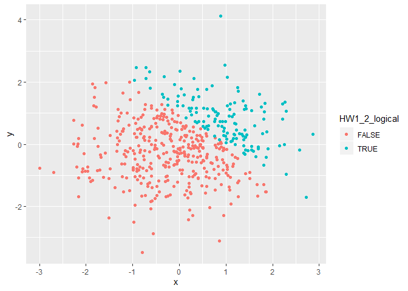
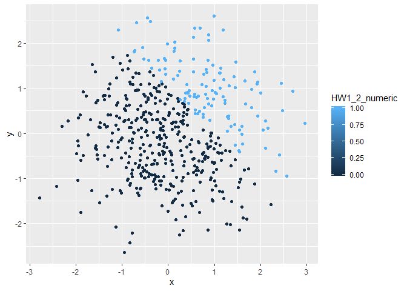
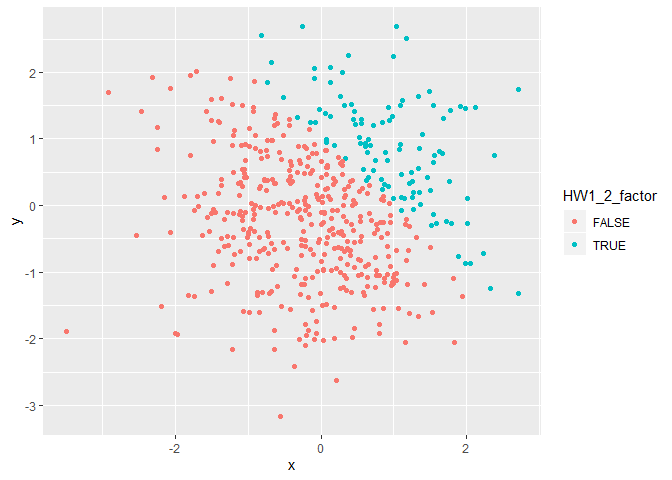

Homework 1 - Building Blocks
================
Kristi Chau
2019-09-20

# Problem 1

**Creating a dataframe**

``` r
library(tidyverse)

HW1_1_df = tibble(
  HW1_1_samp = rnorm(8),
  HW1_1_samp_pos = HW1_1_samp > 0,
  HW1_1_char = c("This","is","my","first","home","work","assignment","yay"),
  HW1_1_factor = factor(c("Kittens","are","cute","Kittens","are","cute","are","cute")),
)
```

**Trying to take the mean of each variable**

``` r
mean(pull(HW1_1_df, HW1_1_samp))
## [1] 0.6080542
mean(pull(HW1_1_df, HW1_1_samp_pos))
## [1] 0.75
mean(pull(HW1_1_df, HW1_1_char))
## Warning in mean.default(pull(HW1_1_df, HW1_1_char)): argument is not
## numeric or logical: returning NA
## [1] NA
mean(pull(HW1_1_df, HW1_1_factor))
## Warning in mean.default(pull(HW1_1_df, HW1_1_factor)): argument is not
## numeric or logical: returning NA
## [1] NA
```

**What worked and what didn’t?**

I was not able to take the mean of the last 2 variables because they
were not numeric or logical vectors.

**Applying the as.numeric function to the logical, character, and factor
variables**

``` r
as.numeric(pull(HW1_1_df, HW1_1_samp_pos))
as.numeric(pull(HW1_1_df, HW1_1_char))
as.numeric(pull(HW1_1_df, HW1_1_factor))
```

**What happened, and why?**

The logical vector returned as numbers corresponding to TRUE or FALSE.
The character vector was unable to return numeric values and instead
returned NA. The factor vector returned numeric values although they
corresponded to the levels rather than the vector itself.

**Creating a new code chunk to manipulate variables from the dataframe**

``` r
HW1_1_rsamp = pull(HW1_1_df,HW1_1_samp)
HW1_1_rsamp_pos = pull(HW1_1_df,HW1_1_samp_pos)

HW1_1_samp_num = as.numeric(HW1_1_rsamp_pos)
HW1_1_samp_num * HW1_1_rsamp
## [1] 0.0000000 0.8303583 1.1949264 2.3693581 1.6931128 0.5411691 0.7197423
## [8] 0.0000000

HW1_1_samp_factor = as.factor(HW1_1_rsamp_pos)
HW1_1_samp_factor * HW1_1_rsamp
## Warning in Ops.factor(HW1_1_samp_factor, HW1_1_rsamp): '*' not meaningful
## for factors
## [1] NA NA NA NA NA NA NA NA

HW1_1_samp_num2 = as.numeric(HW1_1_samp_factor)
HW1_1_samp_num2 * HW1_1_rsamp
## [1] -0.4462862  1.6607166  2.3898528  4.7387163  3.3862255  1.0823383
## [7]  1.4394846 -2.0379474
```

# Problem 2

**Creating a new dataframe**

``` r
HW1_2_df = tibble(
  x = rnorm(500),
  y = rnorm(500),
  HW1_2_logical = x + y > 1,
  HW1_2_numeric = as.numeric(HW1_2_logical),
  HW1_2_factor = as.factor(HW1_2_logical)
)
```

The size of the data set `HW1_2_df` is 2500. The mean of `x` is
0.032417. The median of `x` is -0.0510727. The standard deviation of `x`
is 0.9754546. The proportion of cases for which `x + y > 1` is 0.234.

**Scatterplots**

<!-- -->

<!-- -->

<!-- -->

The color scales for the logical and factor variables are binary
TRUE/FALSE scales. For the numeric variable, the color scale is a
continuous scale from 0.00 to 1.00.

``` r
ggsave("Plot_1.png", plot = plot_logical)
```
